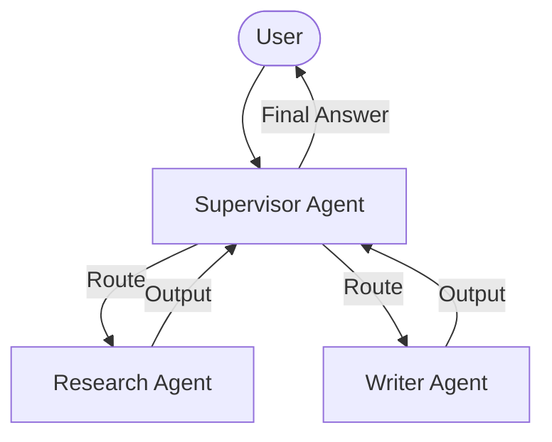
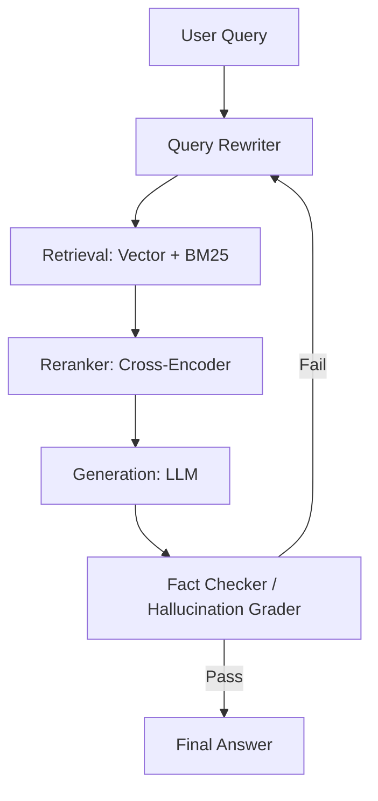

# Reference Agent & RAG Architectures

This reference guide outlines the standard architectures and design patterns used for building agents and Retrieval-Augmented Generation (RAG) pipelines in this workspace.

---

## 1. Multi-Agent Workflows (LangGraph)

When building complex applications, a single agent can quickly become overwhelmed by many tools and complex logic. We prefer **multi-agent architectures** where specialized agents collaborate.

### Supervisor Pattern
A supervisor agent orchestrates the workflow. It receives the user input, decides which specialized sub-agent to call, receives the sub-agent's response, and decides the next step (either calling another sub-agent or returning the final answer to the user).

### Choreography / Peer Handoffs
Agents pass the state directly to each other without a central supervisor. Each agent is responsible for inspecting the state and determining if they need to perform work or hand off to another agent.

---

## 2. Advanced RAG Pipeline

For search and knowledge retrieval, we use a multi-stage RAG pipeline to ensure high recall and precision.

### Stages:
1. **Query Rewriting**: Transforms the user query to optimize vector database retrieval.
2. **Hybrid Search**: Combines semantic search (vector database) with lexical search (BM25) to leverage both keyword matches and semantic context.
3. **Re-ranking**: Re-scores retrieve documents using a Cohere/HuggingFace Cross-Encoder to select the top $K$ most relevant passages.
4. **Fact Checking & Evaluation**: Uses a guardrail node to evaluate the generation against the source documents (hallucination grade) and user query (usefulness grade).
